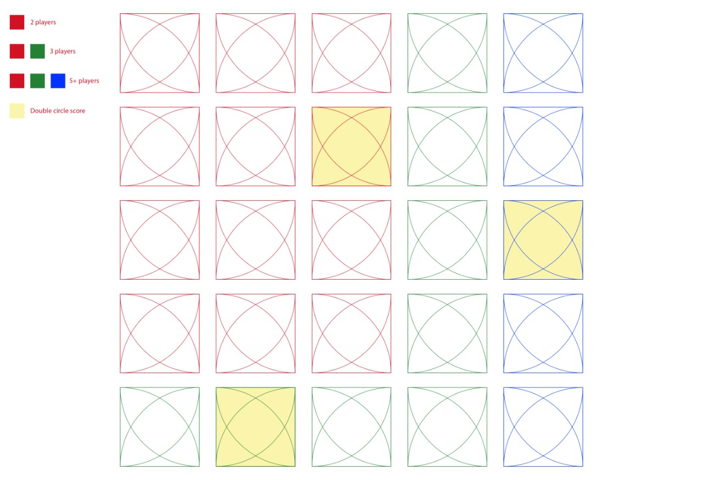

# DES 391-1 Modding Assignment

The game has a digital version  hosted here to [play](https://tabletopia.com/players/id1929536/19qb8n/play).
## 1. The original Idea
 * The original game was based around the idea of arranging four quadrants (with different patterns) on the board in such a way that it forms a full circle. If all the four quadrants are made of same pattern, the player gets bonus points. 
 * The player can either turn a quadrant, add a quadrant, remove a quadrant by adding the same pattern.
 * The player who finishes his cards first gets eliminated.
 * Yellow sqaure leads to bonus. 

<table border="0">
 <tr>
    <td></td>
    <td></td>
 </tr>
 <tr>
    <td>The Board</td>
    <td>Winning Condition</td>
 </tr>
</table>

## 2. First iteration (Proposed by Prayas Sir)
  The first iteration to the change in the rules was proposed by Prayas sir, and he expected us to perform similar modifications to game and then playtest it. These rules were as follows - 
   * Players can add, remove or rotate a card to complete a 3/4th circle. This change was proposed as winning earlier was quite hard which led to less player retention.
   * Players can either add, remove or rotate a card in one chance. A player can only turn up as many corners as the number shown on the dice. This adds randomness to the game which might introduce many 'Wow' moments that were earlier unexplored.
   * To remove a card, place the card with the same pattern, and remove both the cards. A player can only remove card three times in a game.
   * A player who completes a 3/4th circle removes the pieces from the board and earns as many points as the constituent's pieces.
   * The score is doubled if any of the 3/4th circle cards are on the yellow square.
   * The player who earns 25 points first wins.
   * Emptying the boards will give a penalty of 10 points. This puts a constrain that prevents people from removing the cards that others have put up.  

<table border="0">
 <tr>
    <td></td>
    <td></td>
 </tr>
 <tr>
    <td>4 Sided Dice</td>
    <td>Winning Condition</td>
 </tr>
</table>

## 3. New Rules (Proposed by us)
 * The biggest issue we found with the game was the fact that it had pacing issues in the begining as it took a lot of time to add enough pieces on the board for the game to be somewhat playable.
 * So just like most of the games that follow the [match-3 mechanic](https://en.wikipedia.org/wiki/Category:Match_3_games) we decided upon giving the player a randomly shuffuled deck of pieces on the board to start with. All the decks are arranged in the same direction.
 * Players get to either rotate a piece clockwise/anticlockwise by 90 degree or swap it with a card in the same horizontal/vertical grid.
 * The winning condition is kept to be completing a 3/4th circle as suggested in the first iteration of rules by Prayas sir.
 * The completed quarter circle stays on the board and the spaces that it takes up is yielded as unplayable. These pieces are turned upside down and they have a cross mark behind that indicates that those pieces are now unplayable.
 * The game is timed and whoever scores the maximum points before the timer runs out wins the game. Apart from this, the game can even be concluded before the timer runs out if there is no playable space for a quarter circle to be formed left.

*New Board*
 <table border="0">
 <tr>
    <td></td>
    <td></td>
 </tr>
 <tr>
    <td>Rotation Rule</td>
    <td>Grid Rule</td>
 </tr>
</table>

