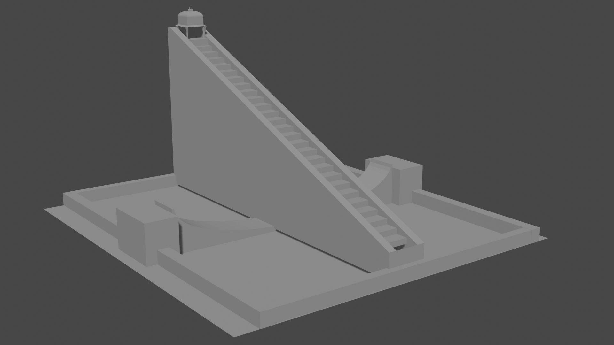
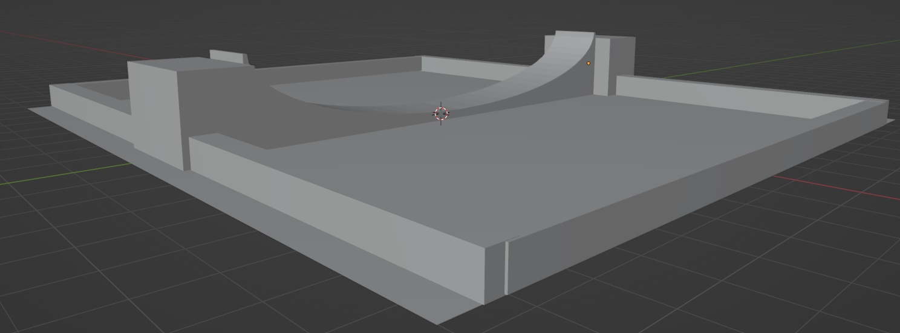
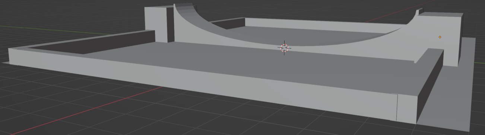

## DES 499 - Jantar Mantar Reconstruction

As a part of this project course we're expected to create a physically precise interactive model of the various yantras at [Jantar Mantar](https://www.jantarmantar.org/) in Unity.  This project is being mentored by [Sameer Sahasrabudhe](https://iitgn.ac.in/faculty/design/sameer).

### 1.0 Week - 1
### 1.1 Blender & 3D Models
* We also collected some [Reference Online Material](https://docs.google.com/document/d/1l8tKDSJfwaVZQedeRZSi7APF9uCLk7THDPQUlbR4L1Q/edit?usp=sharing)  
    * We couldn't find any document which depicts the exact dimensions of Jantar Mantar, but we found a website containing paper model replica of jantar mantar.     
* Building approxiamate models of [Samrat Yantra](https://www.jantarmantar.org/learn/observatories/instruments/samrat/index.html) in Blender.
    * The model we made was not accurate and had some flaws. We will work on this in 
      the next week.
      
    
    
     
    <table border="0">
    <tr>
    <td></td>
    <td></td>    
    </tr>
    <tr>
        <td>Left Side - Base</td>
        <td>Right Side - Base</td>
    </tr>
    </table>
    
    
### 1.2 Day & Night Cycles
 My job was to script the day & night cycles in Unity (need not be physically precise initially).
 * I used a Procedural Sky shader for skybox as it comes with a sun that mimics the directional light by default.
 * Then I bound the directional light's rotation and intensity, fog color and a clock to the day & night cycle. 

<video style="width:100%" autoplay on>
  <source src="../files/day_night.mp4" type="video/mp4">  
</video>

