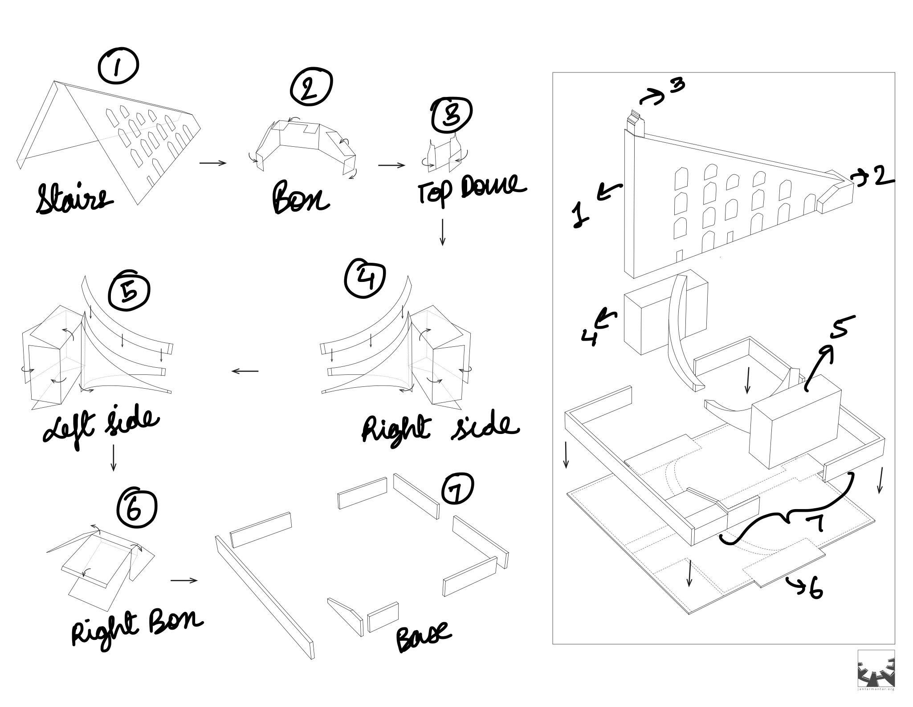
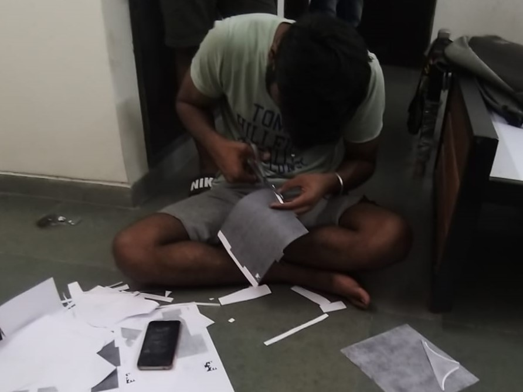

## DES 499 - Jantar Mantar Reconstruction

As a part of this project course we're expected to create a physically precise interactive model of the various yantras at [Jantar Mantar](https://www.jantarmantar.org/) in Unity.  This project is being mentored by [Sameer Sahasrabudhe](https://iitgn.ac.in/faculty/design/sameer).

### 1.0 Week - 1
In the first week we were mostly expected to collect reference materials online as well as start working upon rough models of few of the Yantars (need not be physically accurate).

### 1.1 Reference Materials
* We collected a lot of Reference Materials and listed them [here](https://docs.google.com/document/d/1l8tKDSJfwaVZQedeRZSi7APF9uCLk7THDPQUlbR4L1Q/edit?usp=sharing).  
* Although, we couldn't find any document that depicted the exact dimensions of Jantar Mantar, but we did find a [website](https://www.jantarmantar.org/resources/Projects/SY-Model/Samrat-Yantra-Model-Templates.pdf) containing the paper model replica of jantar mantar.     
    
### 1.2 3D Models 
* Then we created rough models of the [Samrat Yantra](https://www.jantarmantar.org/learn/observatories/instruments/samrat/index.html) in Blender based on the resources we could procure.
* As the model didn't take CAD dimensions into account, it sure had some flaws that were pointed by Sameer Sir in our weekly meetings. Especially the fact that the base model wasn't symmetrical from both the sides.
* We were later expected to come up with dimensionally accurate models based on CAD and paper model replicas that we found.
    
 

<table border="0">
 <tr>
    <td></td>
    <td></td>
 </tr>
 <tr>
    <td>Left Side - Base</td>
    <td>Right Side - Base</td>
 </tr>
</table>

*Not Symmetrical*   

### 1.3 Day & Night Cycles
 My job was to script the day & night cycles in Unity (need not be physically precise initially).
 * I used a Procedural Sky shader for skybox as it comes with a sun that mimics the directional light by default.
 * Then I bound the directional light's rotation and intensity, fog color and a clock to the day & night cycle. 

<video style="width:100%" autoplay muted loop>
  <source src="../files/day_night.mp4" type="video/mp4">  
</video>

### 2.0 Week - 2
In the next week we were assigned the task to come up with labelled Jantar Mantar Engineering Drawings, paper prototype and 3D models of Jantar Mantar that we obtained online and adding a rough sundial model in Unity to check if the shadows casted by the day & night cycle are working properly. 

### 2.1 Precision CAD modelling
* We were suggested to make accurate CAD model from any random CAD design to learn precision CAD modelling.
* The blend file can be found [here](../files/Perc.blend)

<table border="0">
 <tr>
    <td></td>
    <td></td>
 </tr>
 <tr>
    <td>CAD Design</td>
    <td>Model Render</td>
 </tr>
</table>

### 2.2 Labelling of Engineering Drawings
* All the engineering drawings were labeled to make their assembly (for 3D model and paper prototype) easier.
* As we didn't have a lot of dimensionally accurate references for the Samrat Yantra, so we used online references to manually label each of them individually first and then come up with a rough idea how the model and paper model was to be assembled.

 

### 2.3 Making of Paper Prototype
* The engineering drawings after analysis and labelling were converted into a paper prototype for us to visualize.
* The process was fairly simple as these engineering drawings were originally meant for paper prototyping itself. So we had to cut and glue them accordingly.
* The prototypes were dimensionally accurate and represented a scaled down model of Samrat Yantra.
* As the paper was quite thin, the model wasn't structurally intact.

 

### 2.4 Shadows in Unity
* I decided to use a cylinder model to simulate how the sun would cast its shadows on a full day and night cycle. 
* The shadows depicted linear movement (motion on a straight line) unlike the sundial with roughly works like a clock and the dial rotates in a clockwise fashion.
  
<video style="width:100%" autoplay muted loop>
  <source src="../files/shadow_day_night_.mp4" type="video/mp4">  
</video>

### 3.0 Week - 3
In this week we were expected to start working the UX that our project had to offer. 
* For this we were expected to give the day/night cycle and camera controls to the user as well as allow the user to input any time to check the shadow configuration at that time. 
* We also decided to replace the existing cylinder that depicted the sundial with an actual sundial model along with proper sundial markings.
* Some people began working on the game's UI as well.

### 3.1 Sundial Model
* A sundial was modeled based on refrence dimensions that we obtained online.
* It was quite surprising to see that the shadows were rotating perfectly just due to the shape of the dial while keeping the rotation pattern of the sun same as before.
* Add cyl vs sundial and model img here.

### 3.1 Day/Night Cycle & Camera Controls
* Unity's default input system was used to take the input of the players.
* The horizontal axis was assigned to the rotation of the camera whereas the vertical axis was kept responsible for the day/night cycle.
* A dedicated prompt was shown on the screen to inform the users about the same.

<video style="width:100%" autoplay muted loop>
  <source src="../files/user_control.mp4" type="video/mp4">  
</video>